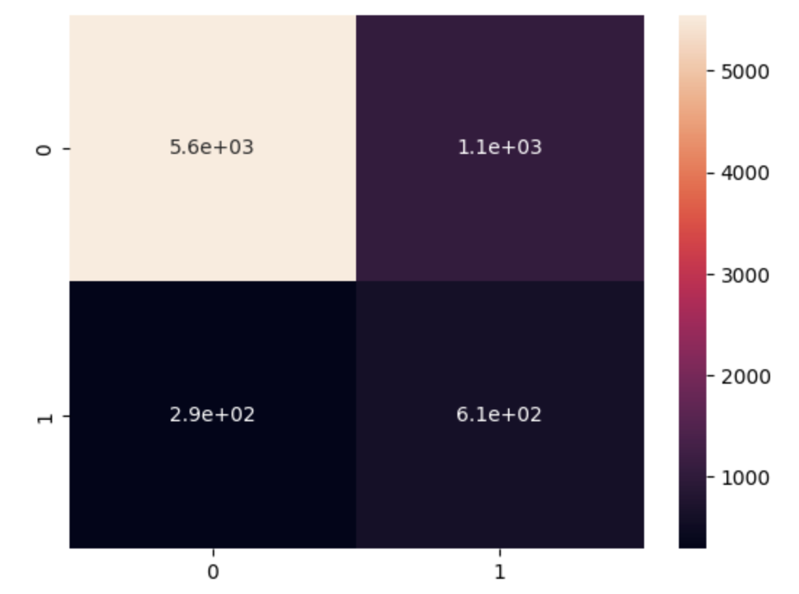
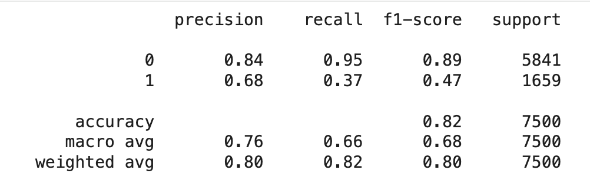
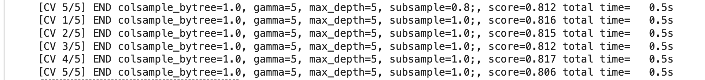
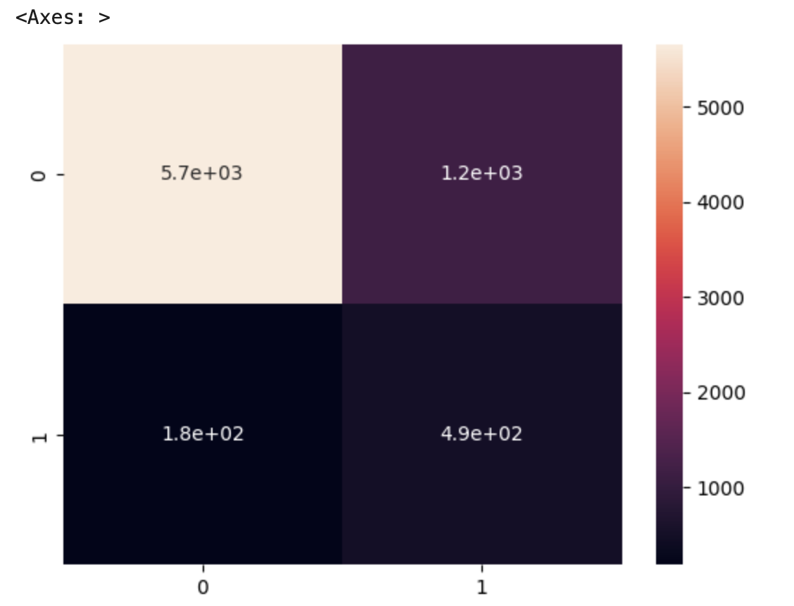
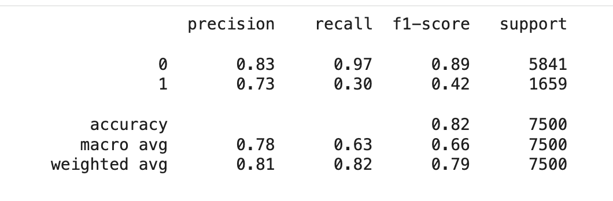

# Credit Card Default Prediction - AI in Business & AutoML

## Table of Contents
1. [Business Context](#business-context)
2. [Dataset](#dataset)
3. [Analytical Approach](#analytical-approach)
4. [Project Pipeline](#project-pipeline)
   - [1. Data Cleaning & Preparation](#1-data-cleaning--preparation)
   - [2. Train and evaluate an XGBoost classifier](#2-train-and-evaluate-an-xgboost-classifier)
   - [3. Optimize xgboost hyperparameters using grid search](#3-optimize-xgboost-hyperparameters-using-grid-search)
5. [Results](#results)
6. [Business Insights](#business-insights)
7. [Tech Stack](#tech-stack)
8. [Key Takeaway](#key-takeaway)


---

## Business Context
- **Institution:** A commercial bank in Taiwan
- **Business Problem:** Predict whether a client will default on their next payment.
- **Goal:** Improve credit risk management and profitability through predictive modeling.
- **Impact:**
  - Reduce expected credit losses (ECL)
  - Optimize credit limits and lending strategy
  - Enable proactive customer engagement

---

## Dataset
- **Source:** [UCI / Kaggle - Default of Credit Card Clients Dataset](https://www.kaggle.com/uciml/default-of-credit-card-clients-dataset)
- **Period:** April 2005 - September 2005
- **Size:** 30,000 observations, 25 variables
- **Target:** `default.payment.next.month`
- **Key Features:**
  - `LIMIT_BAL`: Credit limit
  - `SEX`, `EDUCATION`, `MARRIAGE`, `AGE`: Demographics
  - `PAY_0` - `PAY_6`: Payment delays
  - `BILL_AMT1` - `BILL_AMT6`: Bill statement amounts
  - `PAY_AMT1` - `PAY_AMT6`: Payment amounts

---

## Analytical Approach

The analytical approach for this project focuses on building, optimizing, and evaluating an XGBoost classifier to generate data-driven insights that support the defined business goal


---

## Project Pipeline


| Step                                | Methodology                                                                                                                                 | Key Points                                             |
| ----------------------------------- | ------------------------------------------------------------------------------------------------------------------------------------------- | ------------------------------------------------------ |
| **Data Cleaning & Preparation**     | - Removed irrelevant `ID` field<br>- Encoded categorical features (SEX, EDUCATION, MARRIAGE)<br>- Scaled all features using Min-Max scaling | Ensured consistent numeric input for models            |
| **Exploratory Data Analysis (EDA)** | - Visualized distributions (Bill, Pay Amounts)<br>- Checked outliers & correlations                                                         | Found skewed data & class imbalance (defaults  22%)   |
| **MTrain and evaluate an XGBoost classifie**                 | - Tested **XGBoost Classifier** (binary:logistic)<br>- Compared performance with default vs. optimized hyperparameters                      | XGBoost chosen for high interpretability & performance |
| **Optimization (Grid Search)**      | - Tuned `max_depth`, `gamma`, `subsample`, `colsample_bytree`                                                                               | Improved recall & reduced overfitting                  |


### 1. Data Cleaning & Preparation

Remove irrelevant data and divide it into training and test dataset.

#### Remove irrelevant `ID` column
```python
import pandas as pd

creditcard_df = pd.read_csv('default_of_credit_card_clients.csv')
creditcard_df.drop(['ID'], axis=1, inplace=True)

```

#### Create test and training data set

```python
from sklearn.preprocessing import OneHotEncoder

X_cat = creditcard_df[['SEX', 'EDUCATION', 'MARRIAGE']]

onehotencoder = OneHotEncoder()
X_cat = onehotencoder.fit_transform(X_cat).toarray()

```


#### Scaled numerical features (Min–Max Scaling)
```python
from sklearn.preprocessing import MinMaxScaler

X_numerical = creditcard_df[['LIMIT_BAL', 'AGE', 'PAY_0', 'PAY_2', 'PAY_3', 'PAY_4', 'PAY_5', 'PAY_6',
                'BILL_AMT1','BILL_AMT2', 'BILL_AMT3', 'BILL_AMT4', 'BILL_AMT5', 'BILL_AMT6',
                'PAY_AMT1', 'PAY_AMT2', 'PAY_AMT3', 'PAY_AMT4', 'PAY_AMT5', 'PAY_AMT6']]
scaler = MinMaxScaler()
X = scaler.fit_transform(X_all)
y = creditcard_df['default.payment.next.month']
```


#### Split dataset into training and test sets (75/25)
```python
from sklearn.model_selection import train_test_split
X_train, X_test, y_train, y_test = train_test_split(X, y, test_size = 0.25)
```

---

### 2. Train and evaluate an XGBoost classifier

#### Train an XGBoost regressor model
```python
import xgboost as xgb

model = xgb.XGBClassifier(objective ='reg:squarederror', learning_rate = 0.1, max_depth = 5, n_estimators = 100)

model.fit(X_train, y_train)
from sklearn.metrics import confusion_matrix, classification_report

print("Accuracy {} %".format( 100 * accuracy_score(y_pred, y_test)))

```

> **Output:** Accuracy 82.10666666666665 %

#### Test the performance
```python
cm = confusion_matrix(y_pred, y_test)
sns.heatmap(cm, annot=True)
```
<table>
  <tr>
    <td></td>
  </tr>
</table>

```python
print(classification_report(y_test, y_pred))
```
<table>
  <tr>
    <td></td>
  </tr>
</table>

Performance conclusion:
- The XGBoost model achieved 82% accuracy, performing well on the majority class (label 0).
- Overall performance is good (weighted F1-score: 0.80), but improvement is needed for minority class detection.

In the next section we will use grid search to optimize hyperparameters


---


### 3. Optimize XGboost hyperparameters using grid search

Grid parameters are defined and GridSearchCV function will test different combination of these parameters.

After finding the best parameter set, it will automatically retrains the model on the entire training set.

```python
param_grid = {
        'gamma': [0.5, 1, 5],   # regularization parameter
        'subsample': [0.6, 0.8, 1.0], # % of rows taken to build each tree
        'colsample_bytree': [0.6, 0.8, 1.0], # number of columns used by each tree
        'max_depth': [3, 4, 5] # depth of each tree
        }
from xgboost import XGBClassifier

xgb_model = XGBClassifier(learning_rate=0.01, n_estimators=100, objective='binary:logistic')
from sklearn.model_selection import GridSearchCV
grid = GridSearchCV(xgb_model, param_grid, refit = True, verbose = 4)
grid.fit(X_train, y_train)
```
> **Output:**
<table>
  <tr>
    <td></td>
  </tr>
</table>

Using the best XGBoost model found duing grid search (the best hyper parameter combination), we make the predictions on the test dataset and check its performance


```python
y_predict_optim = grid.predict(X_test)
cm = confusion_matrix(y_predict_optim, y_test)
sns.heatmap(cm, annot=True)
```
<table>
  <tr>
    <td></td>
  </tr>
</table>

```python
print(classification_report(y_test, y_predict_optim))
```
<table>
  <tr>
    <td></td>
  </tr>
</table>

Looking at the result, we can see that, the grid search tuning did not significantly improve overall model performance.
The optimized model became more precise for class one.

---

## Results

| Metric | Before Tuning | After Tuning |
|--------|----------------|--------------|
| Accuracy | 82% | 82% |
| Recall (Default) | 0.95 | 0.97 |
| Precision (Default) | 0.68 | 0.73 |

- Model Accuracy (Local): ~82% accuracy with XGBoost (post-optimization).
More importantly:
- Recall (defaults): Improved after tuning, catching more risky customers.
- Precision: Acceptable, though some false positives (customers wrongly flagged as risky) remain.

---

## Business Insights
- Frequent or longer payment delays are the strongest predictors.
- Lower credit limits and higher unpaid bills increase default risk.
- Distinct repayment behaviors appear across education/marital groups.
- Model enables targeted credit policy and dynamic limit management.

---

## Business Impact and Recommendation 
Business Impact & Recommendations

✅ Business Value
 - Risk Reduction: Enables early identification of potential defaulters, reducing expected credit losses.
 - Profitability Optimization:
o	Focus marketing on reliable clients.
o	Adjust credit limits dynamically.
o	Apply personalized interest rates or early warning notifications.


💡 Recommendations
1.	Adopt recall-oriented metric (AUC/Recall@1): Prioritize catching high-risk clients even if false positives increase slightly.
2.	Integrate cost-sensitive learning: Balance between missed defaults (FN) and wrongly flagged customers (FP).
3.	Implement SHAP explainability: Help credit officers understand why the model flagged a customer.
4.	Regular retraining: Update the model quarterly to adapt to new customer behavior patterns.
5. The approach can be scaled and deployed to support real-time business analytics using platforms like AWS SageMaker.


## Tech Stack
| Category | Tools / Libraries |
|-----------|------------------|
| Data | Pandas, NumPy |
| Visualization | Matplotlib, Seaborn |
| ML Modeling | Scikit-learn, XGBoost |


---

## Key Takeaway
This project demonstrates how AI and AutoML can strengthen financial decision-making by providing an interpretable, scalable, and data-driven credit risk solution.

Conclusion
This project demonstrates how AI and AutoML can transform traditional credit risk management.
Using XGBoostthe bank gains a scalable, data-driven solution for early default detection, enabling proactive credit policies, improved profitability, and responsible lending practices.


